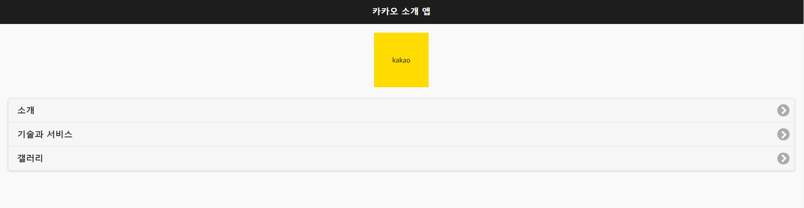
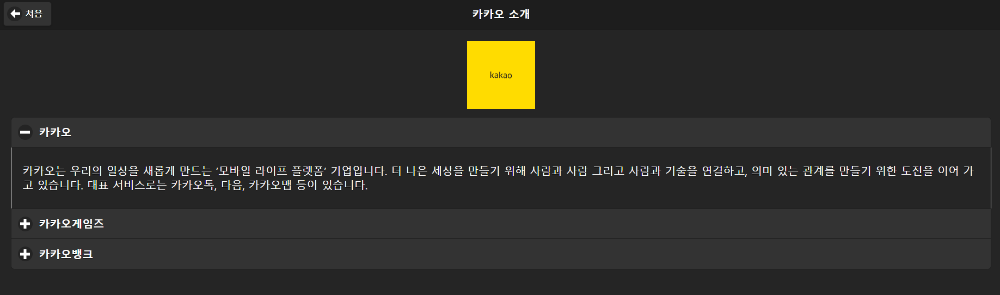
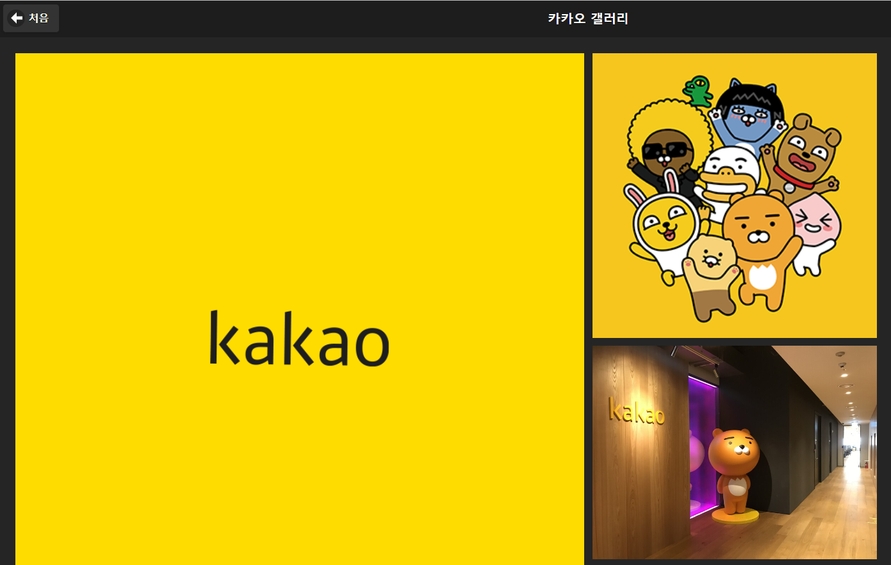

## 프로젝트 소개

[사이트 바로가기](https://leeyeong4067.github.io/mobileApp/) 

   
  카카오톡 회사소개 사이트트 입니다. 
   
  
   
  

  + **Skill** 해당 언어의 능력을 EChart를 통해 표현했습니다 . 

  

  + **Project** 지금 까지 작업한 프로젝트 내용들을 볼수 있습니다. 

 

## 디렉토리 구조

  + **img**: MD 및 웹사이트의 이미지 파일이 들어있습니다.
  + **css**: css 파일이 들어있습니다.

 

## 사용 언어

|   HTML  |   CSS   |   jQuery   |  JavaScript  |
| :-----: | :-----: |  :------:  | :----------: |
